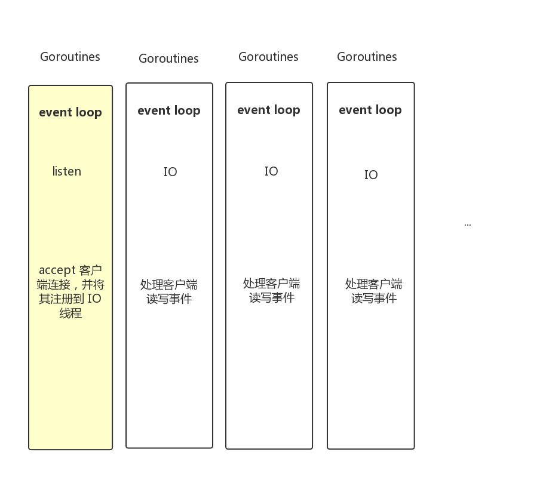
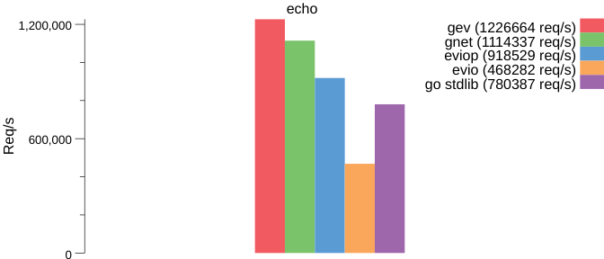

# gev

[](https://github.com/Allenxuxu/gev/actions)
[](https://goreportcard.com/report/github.com/Allenxuxu/gev)
[](https://www.codacy.com/manual/Allenxuxu/gev?utm_source=github.com&amp;utm_medium=referral&amp;utm_content=Allenxuxu/gev&amp;utm_campaign=Badge_Grade)
[](https://github.com/Allenxuxu/gev/blob/master/LICENSE)
[](https://img.shields.io/github/languages/code-size/Allenxuxu/gev.svg?style=flat)

`gev` 是一个轻量、快速的基于 Reactor 模式的非阻塞 TCP 网络库。

## 特点

- 基于 epoll 和 kqueue 实现的高性能事件循环
- 支持多核多线程
- 动态扩容 Ring Buffer 实现的读写缓冲区
- 异步读写
- SO_REUSEPORT 端口重用支持

## 网络模型

`gev` 只使用极少的 goroutine, 一个 goroutine 负责监听客户端连接，其他 goroutine （work 协程）负责处理已连接客户端的读写事件，work 协程数量可以配置，默认与运行主机 CPU 数量相同。



## 性能测试

> 测试环境 Ubuntu18.04

和同类库的简单性能比较, 压测方式与 evio 项目相同。

- gnet
- eviop
- evio
- net (标准库)

限制 GOMAXPROCS=1，1 个 work 协程


限制 GOMAXPROCS=1，4 个 work 协程


限制 GOMAXPROCS=4，4 个 work 协程



## 安装

```bash
go get -u github.com/Allenxuxu/gev
```

## 示例

```go
package main

import (
	"flag"
	"strconv"
	"log"

	"github.com/Allenxuxu/gev"
	"github.com/Allenxuxu/gev/connection"
	"github.com/Allenxuxu/ringbuffer"
)

type example struct{}

func (s *example) OnConnect(c *connection.Connection) {
	log.Println(" OnConnect ： ", c.PeerAddr())
}
func (s *example) OnMessage(c *connection.Connection, buffer *ringbuffer.RingBuffer) (out []byte) {
	//log.Println("OnMessage")
	first, end := buffer.PeekAll()
	out = first
	if len(end) > 0 {
		out = append(out, end...)
	}
	buffer.RetrieveAll()
	return
}

func (s *example) OnClose() {
	log.Println("OnClose")
}

func main() {
	handler := new(example)
	var port int
	var loops int

	flag.IntVar(&port, "port", 1833, "server port")
	flag.IntVar(&loops, "loops", -1, "num loops")
	flag.Parse()

	s, err := gev.NewServer(handler,
		gev.Network("tcp"),
		gev.Address(":"+strconv.Itoa(port)),
		gev.NumLoops(loops))
	if err != nil {
		panic(err)
	}

	s.Start()
}
```

## 参考

本项目受 evio 启发，参考 muduo 实现。

- [evio](https://github.com/tidwall/evio)
- [muduo](https://github.com/chenshuo/muduo)
