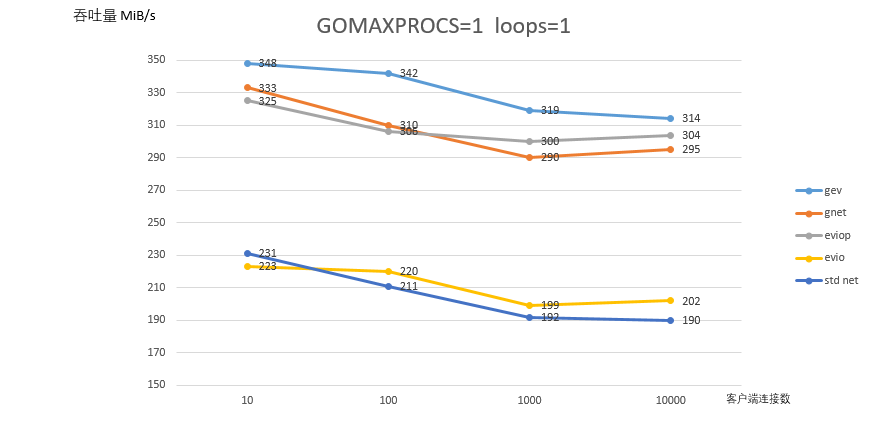
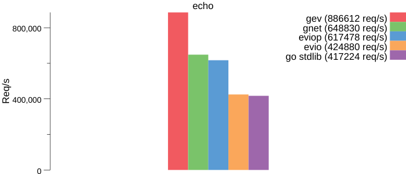

# gev

[](https://github.com/Allenxuxu/gev/actions)
[](https://goreportcard.com/report/github.com/Allenxuxu/gev)
[](https://www.codacy.com/manual/Allenxuxu/gev?utm_source=github.com&amp;utm_medium=referral&amp;utm_content=Allenxuxu/gev&amp;utm_campaign=Badge_Grade)
[](https://godoc.org/github.com/Allenxuxu/gev)
[](https://github.com/Allenxuxu/gev/blob/master/LICENSE)
[](https://img.shields.io/github/languages/code-size/Allenxuxu/gev.svg?style=flat)

### [[English]](README-EN.md)

`gev` 是一个轻量、快速的基于 Reactor 模式的非阻塞 TCP 网络库。

## 特点

- 基于 epoll 和 kqueue 实现的高性能事件循环
- 支持多核多线程
- 动态扩容 Ring Buffer 实现的读写缓冲区
- 异步读写
- SO_REUSEPORT 端口重用支持

## 网络模型

`gev` 只使用极少的 goroutine, 一个 goroutine 负责监听客户端连接，其他 goroutine （work 协程）负责处理已连接客户端的读写事件，work 协程数量可以配置，默认与运行主机 CPU 数量相同。


## 性能测试

> 测试环境 Ubuntu18.04 | 4 Virtual CPUs | 4.0 GiB

### 吞吐量测试

限制 GOMAXPROCS=1（单线程），1 个 work 协程



限制 GOMAXPROCS=4，4 个 work 协程


### 其他测试

<details>
  <summary> 速度测试 </summary>

和同类库的简单性能比较, 压测方式与 evio 项目相同。

- gnet
- eviop
- evio
- net (标准库)

限制 GOMAXPROCS=1，1 个 work 协程



限制 GOMAXPROCS=1，4 个 work 协程


限制 GOMAXPROCS=4，4 个 work 协程


</details>

## 安装

```bash
go get -u github.com/Allenxuxu/gev
```

## 快速入门

```go
package main

import (
	"log"

	"github.com/Allenxuxu/gev"
	"github.com/Allenxuxu/gev/connection"
	"github.com/Allenxuxu/ringbuffer"
)

type example struct{}

func (s *example) OnConnect(c *connection.Connection) {
	log.Println(" OnConnect ： ", c.PeerAddr())
}

func (s *example) OnMessage(c *connection.Connection, buffer *ringbuffer.RingBuffer) (out []byte) {
	log.Println("OnMessage")
	first, end := buffer.PeekAll()
	out = first
	if len(end) > 0 {
		out = append(out, end...)
	}
	buffer.RetrieveAll()
	return
}

func (s *example) OnClose(c *connection.Connection) {
	log.Println("OnClose")
}

func main() {
	handler := new(example)

	s, err := gev.NewServer(handler,
		gev.Address(":1833"),
		gev.NumLoops(2),
		gev.ReusePort(true))
	if err != nil {
		panic(err)
	}

	s.Start()
}
```

Handler 是一个接口，我们的程序必须实现它。

```go
type Handler interface {
	OnConnect(c *connection.Connection)
	OnMessage(c *connection.Connection, buffer *ringbuffer.RingBuffer) []byte
	OnClose(c *connection.Connection)
}

func NewServer(handler Handler, opts ...Option) (server *Server, err error) {
```

在消息到来时，gev 会回调 OnMessage ，在这个函数中可以通过返回一个切片来发送数据给客户端。

```go
func (s *example) OnMessage(c *connection.Connection, buffer *ringbuffer.RingBuffer) (out []byte)
```

Connection 还提供 Send 方法来发送数据。Send 并不会立刻发送数据，而是先添加到 event loop 的任务队列中，然后唤醒 event loop 去发送。

更详细的使用方式可以参考示例：[服务端定时推送](example/pushmessage/main.go)

```go
func (c *Connection) Send(buffer []byte) error
```

Connection ShutdownWrite 会关闭写端，从而断开连接。

更详细的使用方式可以参考示例：[限制最大连接数](example/maxconnection/main.go)

```go
func (c *Connection) ShutdownWrite() error
```

[RingBuffer](https://github.com/Allenxuxu/ringbuffer) 是一个动态扩容的循环缓冲区实现。

## 示例

<details>
  <summary> echo server</summary>

```go
package main

import (
	"flag"
	"strconv"
	"log"

	"github.com/Allenxuxu/gev"
	"github.com/Allenxuxu/gev/connection"
	"github.com/Allenxuxu/ringbuffer"
)

type example struct{}

func (s *example) OnConnect(c *connection.Connection) {
	log.Println(" OnConnect ： ", c.PeerAddr())
}
func (s *example) OnMessage(c *connection.Connection, buffer *ringbuffer.RingBuffer) (out []byte) {
	//log.Println("OnMessage")
	first, end := buffer.PeekAll()
	out = first
	if len(end) > 0 {
		out = append(out, end...)
	}
	buffer.RetrieveAll()
	return
}

func (s *example) OnClose() {
	log.Println("OnClose")
}

func main() {
	handler := new(example)
	var port int
	var loops int

	flag.IntVar(&port, "port", 1833, "server port")
	flag.IntVar(&loops, "loops", -1, "num loops")
	flag.Parse()

	s, err := gev.NewServer(handler,
		gev.Network("tcp"),
		gev.Address(":"+strconv.Itoa(port)),
		gev.NumLoops(loops))
	if err != nil {
		panic(err)
	}

	s.Start()
}
```

</details>

<details>
  <summary> 限制最大连接数 </summary>

```go
package main

import (
	"log"

	"github.com/Allenxuxu/gev"
	"github.com/Allenxuxu/gev/connection"
	"github.com/Allenxuxu/ringbuffer"
	"github.com/Allenxuxu/toolkit/sync/atomic"
)

type Server struct {
	clientNum     atomic.Int64
	maxConnection int64
	server        *gev.Server
}

func New(ip, port string, maxConnection int64) (*Server, error) {
	var err error
	s := new(Server)
	s.maxConnection = maxConnection
	s.server, err = gev.NewServer(s,
		gev.Address(ip+":"+port))
	if err != nil {
		return nil, err
	}

	return s, nil
}

func (s *Server) Start() {
	s.server.Start()
}

func (s *Server) Stop() {
	s.server.Stop()
}

func (s *Server) OnConnect(c *connection.Connection) {
	s.clientNum.Add(1)
	log.Println(" OnConnect ： ", c.PeerAddr())

	if s.clientNum.Get() > s.maxConnection {
		_ = c.ShutdownWrite()
		log.Println("Refused connection")
		return
	}
}
func (s *Server) OnMessage(c *connection.Connection, buffer *ringbuffer.RingBuffer) (out []byte) {
	log.Println("OnMessage")
	first, end := buffer.PeekAll()
	out = first
	if len(end) > 0 {
		out = append(out, end...)
	}
	buffer.RetrieveAll()
	return
}

func (s *Server) OnClose() {
	s.clientNum.Add(-1)
	log.Println("OnClose")
}

func main() {
	s, err := New("", "1833", 1)
	if err != nil {
		panic(err)
	}
	defer s.Stop()

	s.Start()
}
```

</details>

<details>
  <summary> 服务端定时推送 </summary>

```go
package main

import (
	"container/list"
	"github.com/Allenxuxu/gev"
	"github.com/Allenxuxu/gev/connection"
	"github.com/Allenxuxu/ringbuffer"
	"log"
	"sync"
	"time"
)

type Server struct {
	conn   *list.List
	mu     sync.RWMutex
	server *gev.Server
}

func New(ip, port string) (*Server, error) {
	var err error
	s := new(Server)
	s.conn = list.New()
	s.server, err = gev.NewServer(s,
		gev.Address(ip+":"+port))
	if err != nil {
		return nil, err
	}

	return s, nil
}

func (s *Server) Start() {
	s.server.RunEvery(1*time.Second, s.RunPush)
	s.server.Start()
}

func (s *Server) Stop() {
	s.server.Stop()
}

func (s *Server) RunPush() {
	var next *list.Element

	s.mu.RLock()
	defer s.mu.RUnlock()

	for e := s.conn.Front(); e != nil; e = next {
		next = e.Next()

		c := e.Value.(*connection.Connection)
		_ = c.Send([]byte("hello\n"))
	}
}

func (s *Server) OnConnect(c *connection.Connection) {
	log.Println(" OnConnect ： ", c.PeerAddr())

	s.mu.Lock()
	e := s.conn.PushBack(c)
	s.mu.Unlock()
	c.SetContext(e)
}
func (s *Server) OnMessage(c *connection.Connection, buffer *ringbuffer.RingBuffer) (out []byte) {
	log.Println("OnMessage")
	first, end := buffer.PeekAll()
	out = first
	if len(end) > 0 {
		out = append(out, end...)
	}
	buffer.RetrieveAll()
	return
}

func (s *Server) OnClose(c *connection.Connection) {
	log.Println("OnClose")
	e := c.Context().(*list.Element)

	s.mu.Lock()
	s.conn.Remove(e)
	s.mu.Unlock()
}

func main() {
	s, err := New("", "1833")
	if err != nil {
		panic(err)
	}
	defer s.Stop()

	s.Start()
}
```

</details>

## 参考

本项目受 evio 启发，参考 muduo 实现。

- [evio](https://github.com/tidwall/evio)
- [muduo](https://github.com/chenshuo/muduo)
